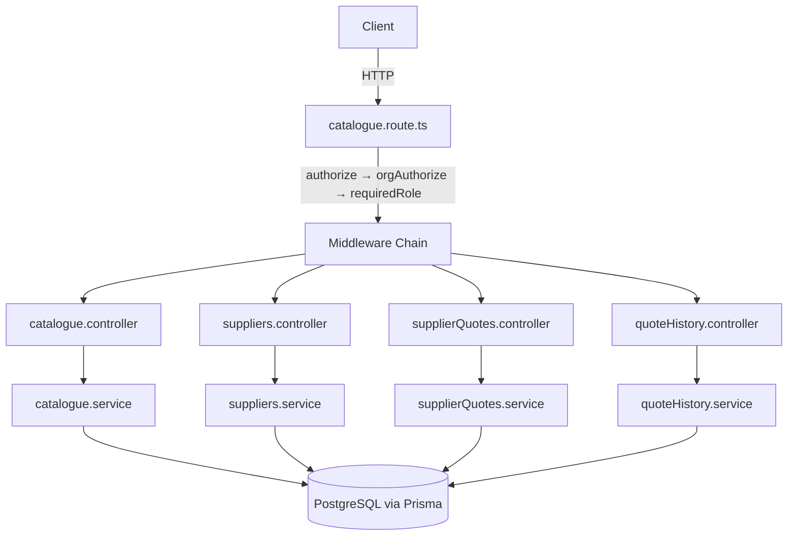

# Design Document — Catalogue Backend

## Overview

The catalogue backend module exposes a REST API under `server/src/modules/catalogue/` for managing catalogue items, suppliers, supplier quotes, and quote history within a multi-tenant construction/engineering platform (Sitecore).

All routes are scoped to the requesting organization (`request.tenant.orgId`) and require an authenticated ADMIN member. The module is split into four sub-domains, each with its own controller, service, and schema file, wired together by a single `catalogue.route.ts`.

**Tech constraints**: Express 5, TypeScript 5.9 strict, Prisma 7, Zod 4. No new packages.

---

## Architecture



### Request lifecycle

1. `authorize` — validates session cookie, attaches `request.session`
2. `orgAuthorize` — resolves org from `x-tenant-slug` header, attaches `request.tenant`
3. `requiredRole("ADMIN")` — checks `request.tenant.role === "ADMIN"`, throws `UnAuthorizedError` otherwise
4. Controller — validates input with Zod, calls service, maps errors to HTTP responses
5. Service — executes Prisma queries scoped to `organizationId`, enforces business rules

### Route ordering rationale

Express matches routes in registration order. `/suppliers` and `/supplier-quotes` prefixed routes must be registered **before** `/:catalogueId` to prevent Express from treating the literal strings `"suppliers"` and `"supplier-quotes"` as `catalogueId` path parameters.

---

## Components and Interfaces

### catalogue.schema.ts

```ts
// List query
export const getCatalogueSchema = z.object({
  organizationId: z.string().min(1),
  pageIndex: z.number().int().min(0).default(0),
  pageSize: z.number().int().min(1).max(100).default(10),
  searchQuery: z.string().default(""),
});
export type GetCatalogueInput = z.infer<typeof getCatalogueSchema>;

// ID param
export const catalogueIdSchema = z.object({ catalogueId: z.string().min(1) });
export type CatalogueIdInput = z.infer<typeof catalogueIdSchema>;

// Create body
export const createCatalogueSchema = z.object({
  name: z.string().min(1),
  category: z.enum(["MATERIALS","LABOUR","EQUIPMENT","SUBCONTRACTORS","TRANSPORT","OVERHEAD"]),
  unit: z.string().min(1),
  defaultLeadTime: z.number().int().min(0).default(0),
});
export type CreateCatalogueInput = z.infer<typeof createCatalogueSchema>;

// Edit body (all fields optional)
export const editCatalogueSchema = createCatalogueSchema.partial();
export type EditCatalogueInput = z.infer<typeof editCatalogueSchema>;
```

### catalogue.service.ts

```ts
catalogueService.getCatalogue(orgId: string, pageIndex: number, pageSize: number, search: string)
  : Promise<{ data: CatalogueItem[]; count: number }>

catalogueService.getCatalogueById(orgId: string, catalogueId: string)
  : Promise<CatalogueItem>  // throws MissingError

catalogueService.createCatalogue(orgId: string, input: CreateCatalogueInput)
  : Promise<CatalogueItem>  // throws ConflictError

catalogueService.editCatalogue(orgId: string, catalogueId: string, input: EditCatalogueInput)
  : Promise<CatalogueItem>  // throws MissingError | ConflictError

catalogueService.deleteCatalogue(orgId: string, catalogueId: string)
  : Promise<void>           // throws MissingError | ConflictError

catalogueService.getQuotesByCatalogueId(orgId: string, catalogueId: string)
  : Promise<{ data: SupplierQuoteWithSupplier[]; count: number }>  // throws MissingError

catalogueService.getSuppliersByCatalogueId(orgId: string, catalogueId: string)
  : Promise<{ data: Supplier[]; count: number }>  // throws MissingError
```

### suppliers.schema.ts

```ts
export const getSuppliersSchema = z.object({
  organizationId: z.string().min(1),
  pageIndex: z.number().int().min(0).default(0),
  pageSize: z.number().int().min(1).max(100).default(10),
  searchQuery: z.string().default(""),
  includeDeleted: z.boolean().default(false),
});

export const supplierIdSchema = z.object({ supplierId: z.string().min(1) });

export const createSupplierSchema = z.object({
  name: z.string().min(1),
  email: z.string().email().optional(),
  phone: z.string().optional(),
  contactPerson: z.string().optional(),
  address: z.string().optional(),
});

export const editSupplierSchema = createSupplierSchema.partial();
```

### suppliers.service.ts

```ts
suppliersService.getSuppliers(orgId, pageIndex, pageSize, search, includeDeleted)
  : Promise<{ data: Supplier[]; count: number }>

suppliersService.getSupplierById(orgId: string, supplierId: string)
  : Promise<Supplier>  // throws MissingError (includes soft-deleted)

suppliersService.createSupplier(orgId: string, input: CreateSupplierInput)
  : Promise<Supplier>  // throws ConflictError

suppliersService.editSupplier(orgId: string, supplierId: string, input: EditSupplierInput)
  : Promise<Supplier>  // throws MissingError | ConflictError

suppliersService.archiveSupplier(orgId: string, supplierId: string)
  : Promise<void>      // throws MissingError | ConflictError

suppliersService.restoreSupplier(orgId: string, supplierId: string)
  : Promise<Supplier>  // throws MissingError | ConflictError

suppliersService.getQuotesBySupplierId(orgId: string, supplierId: string)
  : Promise<{ data: SupplierQuoteWithCatalogue[]; count: number }>  // throws MissingError

suppliersService.getCatalogueItemsBySupplierId(orgId: string, supplierId: string)
  : Promise<{ data: CatalogueItem[]; count: number }>  // throws MissingError
```

### supplierQuotes.schema.ts

```ts
export const getSupplierQuotesSchema = z.object({
  organizationId: z.string().min(1),
  pageIndex: z.number().int().min(0).default(0),
  pageSize: z.number().int().min(1).max(100).default(10),
  catalogueId: z.string().optional(),
  supplierId: z.string().optional(),
});

export const quoteIdSchema = z.object({ quoteId: z.string().min(1) });

export const createSupplierQuoteSchema = z.object({
  catalogueId: z.string().min(1),
  supplierId: z.string().min(1),
  truePrice: z.number().positive(),
  standardRate: z.number().positive(),
  inventory: z.number().int().min(0),
  leadTime: z.number().int().min(0).optional(),
});

export const editSupplierQuoteSchema = z.object({
  truePrice: z.number().positive().optional(),
  standardRate: z.number().positive().optional(),
  inventory: z.number().int().min(0).optional(),
  leadTime: z.number().int().min(0).optional(),
  changeReason: z.string().optional(),
});
```

### supplierQuotes.service.ts

```ts
supplierQuotesService.getSupplierQuotes(orgId, pageIndex, pageSize, catalogueId?, supplierId?)
  : Promise<{ data: SupplierQuoteRow[]; count: number }>

supplierQuotesService.getSupplierQuoteById(orgId: string, quoteId: string)
  : Promise<SupplierQuoteDetail>  // throws MissingError

supplierQuotesService.getQuotesByCatalogueId(orgId: string, catalogueId: string)
  : Promise<{ data: SupplierQuoteWithSupplier[]; count: number }>  // throws MissingError

supplierQuotesService.getQuotesBySupplierId(orgId: string, supplierId: string)
  : Promise<{ data: SupplierQuoteWithCatalogue[]; count: number }>  // throws MissingError

supplierQuotesService.createSupplierQuote(orgId: string, input: CreateSupplierQuoteInput)
  : Promise<SupplierQuoteDetail>  // throws MissingError | ConflictError

supplierQuotesService.editSupplierQuote(orgId, quoteId, input, changedByMemberId?)
  : Promise<SupplierQuoteDetail>  // throws MissingError; uses prisma.$transaction

supplierQuotesService.deleteSupplierQuote(orgId: string, quoteId: string)
  : Promise<void>  // throws MissingError | ConflictError
```

### quoteHistory.schema.ts

```ts
export const getQuoteHistorySchema = z.object({
  quoteId: z.string().min(1),
  organizationId: z.string().min(1),
});

export const getQuoteHistoryByIdSchema = z.object({
  quoteId: z.string().min(1),
  historyId: z.string().min(1),
  organizationId: z.string().min(1),
});
```

### quoteHistory.service.ts

```ts
quoteHistoryService.getQuoteHistory(orgId: string, quoteId: string)
  : Promise<{ data: SupplierQuoteHistory[]; count: number }>  // throws MissingError

quoteHistoryService.getQuoteHistoryById(orgId: string, quoteId: string, historyId: string)
  : Promise<SupplierQuoteHistory>  // throws MissingError
```

### Controller pattern

Every controller method follows this structure:

```ts
async methodName(request: Request, response: Response) {
  try {
    // 1. Extract and validate input
    const parsed = schema.safeParse({ ...request.params, ...request.query, ...request.body });
    if (!parsed.success) throw new ValidationError("...");

    // 2. Call service
    const result = await service.method(request.tenant!.orgId, parsed.data);

    // 3. Return response
    return response.status(200).json({ success: true, message: "...", data: result });
  } catch (error) {
    // 4. Map domain errors to HTTP status codes
    if (error instanceof ValidationError) return response.status(400).json({ success: false, message: error.message });
    if (error instanceof MissingError)    return response.status(404).json({ success: false, message: error.message });
    if (error instanceof ConflictError)   return response.status(409).json({ success: false, message: error.message });
    logger.error(error, { organizationId: request.tenant?.orgId });
    return response.status(500).json({ success: false, message: "Internal server error" });
  }
}
```

---

## Data Models

### Prisma models (relevant fields)

**Catalogue**
- `id` — UUID PK
- `name` — string, unique per org
- `category` — `CatalogueCategory` enum
- `unit` — string
- `defaultLeadTime` — Int, default 0
- `organizationId` — FK → Organization
- Relations: `supplierQuotes[]`, `requisitionItems[]`

**Supplier**
- `id` — UUID PK
- `name` — string, unique per org
- `email`, `phone`, `contactPerson`, `address` — optional strings
- `deletedAt` — `DateTime?` (null = active, non-null = soft-deleted)
- `organizationId` — FK → Organization
- `createdAt`, `updatedAt`

**SupplierQuote**
- `id` — UUID PK
- `truePrice`, `standardRate` — `Decimal` (convert with `Number()` in responses)
- `leadTime` — `Int?`
- `inventory` — `Int`, default 0
- `supplierId` — FK → Supplier (Restrict on delete)
- `catalogueId` — FK → Catalogue (Cascade on delete)
- Unique: `[catalogueId, supplierId]`
- Relations: `assignedItem[]`, `history[]`

**SupplierQuoteHistory**
- `id` — UUID PK
- `supplierQuoteId` — FK → SupplierQuote (Cascade on delete)
- `truePrice`, `standardRate` — Decimal
- `leadTime` — Int?
- `inventory` — Int
- `changeReason` — string?
- `changedByMemberId` — string?
- `changedAt` — DateTime, default now()

### Response type shapes

```ts
// Catalogue item in list/detail responses
type CatalogueItem = {
  id: string;
  name: string;
  category: CatalogueCategory;
  unit: string;
  defaultLeadTime: number;
  organizationId: string;
};

// Supplier quote row (list)
type SupplierQuoteRow = {
  id: string;
  truePrice: number;       // Number(Decimal)
  standardRate: number;    // Number(Decimal)
  leadTime: number | null;
  inventory: number;
  supplierId: string;
  supplierName: string;
  catalogueId: string;
  catalogueName: string;
  createdAt: Date;
  updatedAt: Date;
};

// Supplier quote history entry
type SupplierQuoteHistoryEntry = {
  id: string;
  supplierQuoteId: string;
  truePrice: number;
  standardRate: number;
  leadTime: number | null;
  inventory: number;
  changeReason: string | null;
  changedByMemberId: string | null;
  changedAt: Date;
};
```

### Key data access patterns

**Tenant scoping for SupplierQuote** — no direct `organizationId` on the model; ownership is verified by joining through `Catalogue`:

```ts
prisma.supplierQuote.findFirst({
  where: {
    id: quoteId,
    catalogue: { organizationId: orgId },
  },
});
```

**Tenant scoping for SupplierQuoteHistory** — join through `supplierQuote.catalogue`:

```ts
prisma.supplierQuoteHistory.findFirst({
  where: {
    id: historyId,
    supplierQuote: {
      catalogue: { organizationId: orgId },
    },
  },
});
```

**Soft delete filter** — active suppliers only:

```ts
where: { organizationId: orgId, deletedAt: null }
```

**Pagination**:

```ts
const skip = pageIndex * pageSize;
prisma.catalogue.findMany({ skip, take: pageSize });
```

**Case-insensitive search**:

```ts
where: { name: { contains: search, mode: "insensitive" } }
```

**Conflict detection** — catch Prisma P2002 unique constraint error:

```ts
import { Prisma } from "../../generated/prisma/index.js";

try {
  return await prisma.catalogue.create({ data });
} catch (error) {
  if (error instanceof Prisma.PrismaClientKnownRequestError && error.code === "P2002") {
    throw new ConflictError("A catalogue item with this name already exists.");
  }
  throw error;
}
```

**Quote edit transaction** — history insert + quote update atomically:

```ts
await prisma.$transaction([
  prisma.supplierQuoteHistory.create({
    data: {
      supplierQuoteId: quote.id,
      truePrice: quote.truePrice,
      standardRate: quote.standardRate,
      leadTime: quote.leadTime,
      inventory: quote.inventory,
      changeReason: input.changeReason ?? null,
      changedByMemberId: changedByMemberId ?? null,
    },
  }),
  prisma.supplierQuote.update({
    where: { id: quote.id },
    data: {
      truePrice: input.truePrice ?? quote.truePrice,
      standardRate: input.standardRate ?? quote.standardRate,
      leadTime: input.leadTime ?? quote.leadTime,
      inventory: input.inventory ?? quote.inventory,
    },
  }),
]);
```

**Dependency check before hard delete** — count related records:

```ts
const [quoteCount, itemCount] = await Promise.all([
  prisma.supplierQuote.count({ where: { catalogueId } }),
  prisma.requisitionItem.count({ where: { catalogueId } }),
]);
if (quoteCount > 0 || itemCount > 0) throw new ConflictError("Catalogue item is in use.");
```

---

## Correctness Properties

*A property is a characteristic or behavior that should hold true across all valid executions of a system — essentially, a formal statement about what the system should do. Properties serve as the bridge between human-readable specifications and machine-verifiable correctness guarantees.*


### Property 1: Tenant scoping — reads never cross organization boundaries

*For any* service method that reads `Catalogue`, `Supplier`, `SupplierQuote`, or `SupplierQuoteHistory` records, every record in the returned result set SHALL belong to the organization identified by the `orgId` argument. No record belonging to a different organization SHALL appear in any response.

**Validates: Requirements 2.3, 3.2, 4.3, 24.1, 24.2, 24.3, 24.4, 24.5**

---

### Property 2: Tenant scoping — writes are always scoped to the requesting organization

*For any* service method that creates a `Catalogue` or `Supplier` record, the persisted record SHALL have `organizationId` equal to the `orgId` argument passed to the service.

**Validates: Requirements 4.3, 11.3, 24.1, 24.2**

---

### Property 3: Uniqueness constraint — duplicate names within an org are rejected

*For any* organization and any existing `Catalogue` item name (or `Supplier` name) within that organization, attempting to create or rename another record to the same name SHALL result in a `ConflictError` being thrown.

**Validates: Requirements 4.4, 5.4, 11.4, 12.4**

---

### Property 4: Soft delete filter — active-only queries exclude archived suppliers

*For any* call to `suppliersService.getSuppliers` with `includeDeleted = false`, no supplier with a non-null `deletedAt` SHALL appear in the returned data array. Conversely, when `includeDeleted = true`, suppliers with non-null `deletedAt` SHALL be included.

**Validates: Requirements 9.3, 9.4**

---

### Property 5: Soft delete round-trip — archive then restore returns supplier to active state

*For any* active supplier, archiving it (setting `deletedAt` to a non-null timestamp) and then restoring it (setting `deletedAt` to null) SHALL result in the supplier being queryable as an active record with `deletedAt = null`.

**Validates: Requirements 13.5, 14.5**

---

### Property 6: Dependency check — catalogue items with dependents cannot be hard-deleted

*For any* catalogue item that has one or more associated `SupplierQuote` records or one or more associated `RequisitionItem` records, calling `catalogueService.deleteCatalogue` SHALL throw a `ConflictError` and the record SHALL remain in the database.

**Validates: Requirements 6.4, 6.5**

---

### Property 7: Quote edit history preservation — previous state is captured before every update

*For any* supplier quote edit, the `SupplierQuoteHistory` record created during the edit SHALL contain the `truePrice`, `standardRate`, `leadTime`, and `inventory` values that the quote held immediately before the update was applied.

**Validates: Requirements 20.4, 20.5**

---

### Property 8: Pagination invariant — result count never exceeds requested page size

*For any* list endpoint call with a valid `pageSize` of N, the number of items in the returned `data` array SHALL be less than or equal to N.

**Validates: Requirements 2.5, 9.6, 17.5**

---

### Property 9: Error-to-HTTP-status mapping is consistent across all controllers

*For any* controller method, when the service throws a `ValidationError` the HTTP status SHALL be 400, when it throws a `MissingError` the status SHALL be 404, when it throws a `ConflictError` the status SHALL be 409, and for any other unexpected error the status SHALL be 500.

**Validates: Requirements 25.1, 25.2, 25.3, 25.4, 25.5**

---

## Error Handling

### Error class → HTTP status mapping

| Error class        | HTTP status | When thrown                                                      |
|--------------------|-------------|------------------------------------------------------------------|
| `ValidationError`  | 400         | Zod `safeParse` fails on params, query, or body                  |
| `UnAuthorizedError`| 401 / 403   | Middleware rejects unauthenticated or non-ADMIN requests         |
| `MissingError`     | 404         | Resource not found within the org, or cross-org access attempted |
| `ConflictError`    | 409         | Duplicate name, already soft-deleted, dependency blocks delete   |
| Unknown            | 500         | Unexpected Prisma errors, network failures, unhandled exceptions |

### Prisma error handling

- **P2002** (unique constraint violation) — catch and rethrow as `ConflictError`
- **P2003** (foreign key constraint) — catch and rethrow as `ConflictError` with context
- All other `PrismaClientKnownRequestError` — log and rethrow as generic 500

### Cross-org access

Services never throw a dedicated "forbidden" error for cross-org access. They treat a resource that exists in another org the same as a resource that does not exist at all — throwing `MissingError`. This prevents information leakage about resources in other organizations.

### Decimal conversion

Prisma returns `Decimal` objects for `truePrice` and `standardRate`. All service methods MUST convert these to `number` using `Number()` before returning data to controllers, so JSON serialization is predictable.

```ts
truePrice: Number(quote.truePrice),
standardRate: Number(quote.standardRate),
```

### Logging

Unexpected errors (status 500) are logged via the Winston logger with structured context:

```ts
logger.error(error, {
  organizationId: request.tenant?.orgId,
  resourceId: request.params.catalogueId ?? request.params.supplierId ?? request.params.quoteId,
  endpoint: request.path,
});
```

---

## Testing Strategy

> No tests are required for this feature per the implementation brief. The testing strategy below documents the intended approach for future coverage.

### Unit tests (example-based)

Focus on specific behaviors and edge cases that property tests do not cover:

- Controller returns correct HTTP status for each error type (one example per error class)
- `getCatalogueById` returns 404 for a non-existent ID
- `createCatalogue` returns 201 with the created item on success
- `archiveSupplier` returns 409 when supplier is already soft-deleted
- `restoreSupplier` returns 409 when supplier is already active
- `editSupplierQuote` returns 500 when the transaction fails
- `deleteSupplierQuote` returns 409 when referenced by a `RequisitionItem`

### Property-based tests (if implemented)

This feature involves pure business logic functions (tenant scoping, soft delete filtering, pagination slicing, history capture) that are well-suited to property-based testing. The recommended library is **fast-check** (already available in the Node.js ecosystem, no new packages needed if already present).

Each property test should run a minimum of 100 iterations.

| Property | Test tag |
|----------|----------|
| Property 1: Tenant scoping reads | `Feature: catalogue-backend, Property 1: tenant scoping reads` |
| Property 2: Tenant scoping writes | `Feature: catalogue-backend, Property 2: tenant scoping writes` |
| Property 3: Uniqueness constraint | `Feature: catalogue-backend, Property 3: uniqueness constraint` |
| Property 4: Soft delete filter | `Feature: catalogue-backend, Property 4: soft delete filter` |
| Property 5: Soft delete round-trip | `Feature: catalogue-backend, Property 5: soft delete round-trip` |
| Property 6: Dependency check on delete | `Feature: catalogue-backend, Property 6: dependency check delete` |
| Property 7: Quote history preservation | `Feature: catalogue-backend, Property 7: quote history preservation` |
| Property 8: Pagination invariant | `Feature: catalogue-backend, Property 8: pagination invariant` |
| Property 9: Error-to-HTTP-status mapping | `Feature: catalogue-backend, Property 9: error mapping` |

### Integration tests

- Middleware chain rejects unauthenticated requests (HTTP 401)
- Middleware chain rejects non-ADMIN roles (HTTP 403)
- Route ordering: `/suppliers` and `/supplier-quotes` resolve before `/:catalogueId`
- `prisma.$transaction` for quote edit: both history insert and quote update succeed or both fail
