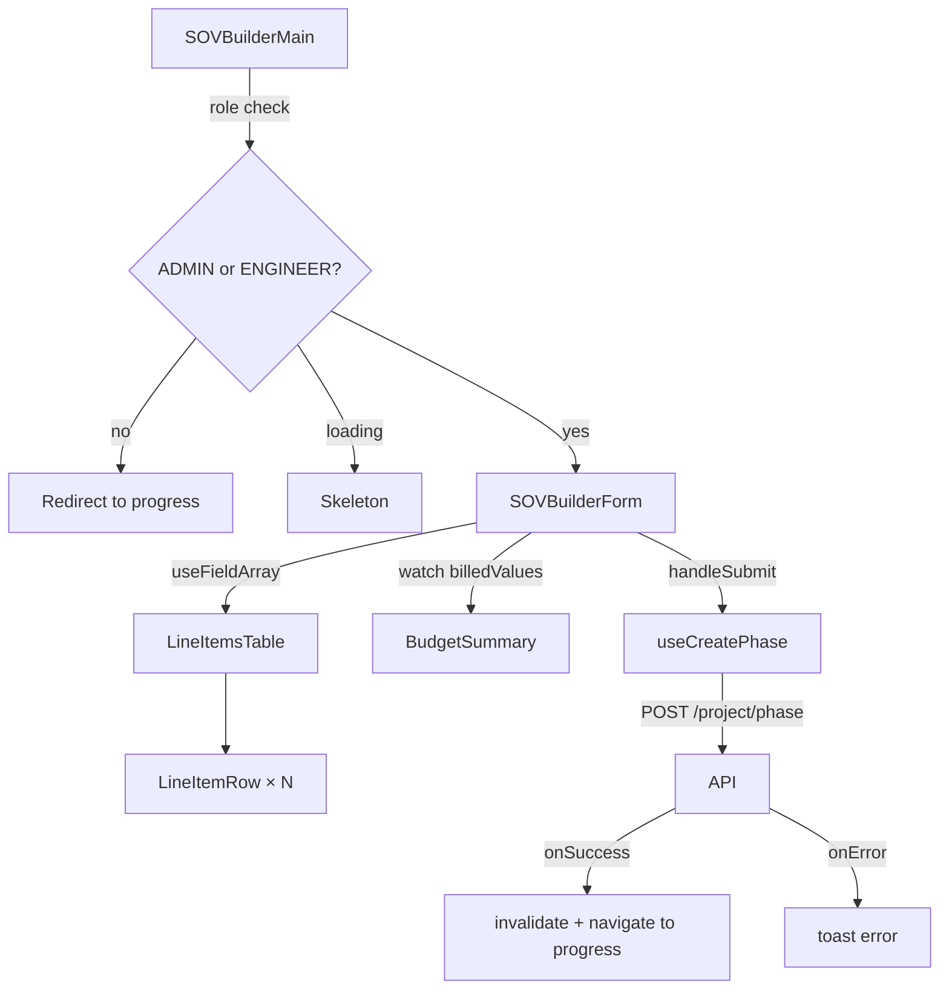

# Design Document: SOV Builder

## Overview

The SOV Builder replaces the existing `CreatePhaseForm` with a richer, single-page form that lets ADMIN and ENGINEER users define a phase's full financial breakdown — the Schedule of Values — before submitting. The form collects phase header fields (name, description, start date, payment deadline) and a dynamic list of line items (name, category, estimated cost, billed value). A real-time budget summary reflects the sum of all billed values as the user builds the list. On valid submission, a single `POST /project/phase` request creates the phase and all its line items atomically.

This is a purely frontend feature. No new backend endpoints are required. The existing `PhaseCreationPage` at `/:orgSlug/:projectSlug/progress/create-phase` will be updated to render `SOVBuilderMain` instead of the old `CreatePhaseForm`.

---

## Architecture

The feature lives entirely within `client/src/features/sovBuilder/` and follows the established feature-based folder structure. It integrates with:

- **React Hook Form + Zod v4** for form state and validation
- **TanStack Query v5** (`useMutation`) for the API call and cache invalidation
- **`useMembership`** (shared hook) for role-based access control
- **React Router DOM v7** (`useNavigate`, `useParams`) for navigation
- **Axios interceptor** at `@/lib/axios` for automatic header injection

```
features/sovBuilder/
├── components/
│   ├── SOVBuilderMain.tsx       # Page-level orchestrator — RBAC guard + layout
│   ├── SOVBuilderForm.tsx       # RHF form, phase header fields, submit logic
│   ├── LineItemsTable.tsx       # useFieldArray wrapper, "Add Line Item" button
│   ├── LineItemRow.tsx          # Single row: 4 inputs + remove button
│   └── BudgetSummary.tsx        # Derived total from watched billedValue fields
├── hooks/
│   └── usePhase.ts              # useCreatePhase mutation hook
└── sovBuilder.schema.ts         # Zod schemas: lineItemSchema, phaseSchema
```

### Data Flow



---

## Components and Interfaces

### `SOVBuilderMain`

Page-level orchestrator. Reads membership via `useMembership()`. Handles three states:

- **Loading**: renders `<SOVBuilderSkeleton />` (a simple skeleton placeholder)
- **CLIENT role or no membership**: calls `navigate` to `../progress` (relative)
- **ADMIN / ENGINEER**: renders `<SOVBuilderForm />`

No form logic lives here — it is purely a guard and layout shell.

```ts
// Props: none — reads params and membership internally
```

### `SOVBuilderForm`

The main RHF form. Owns the `useForm` instance with `zodResolver(phaseSchema)`. Renders:

- Phase header fields (name, description, startDate, paymentDeadline)
- `<LineItemsTable />` — receives `control`, `errors`, and `register` from the form
- `<BudgetSummary />` — receives the watched `lineItems` array
- Submit and Cancel buttons

On submit, converts date strings to ISO 8601 and calls `createPhase.mutate(payload)`.

```ts
interface SOVBuilderFormProps {
  // none — self-contained, reads params internally
}
```

### `LineItemsTable`

Wraps `useFieldArray({ control, name: 'lineItems' })`. Renders the table header row and maps `fields` to `<LineItemRow />` components. Contains the "Add Line Item" button which calls `append(defaultLineItem)`. Enforces the minimum-one-row invariant: the remove button on a row is disabled (or hidden) when `fields.length === 1`.

```ts
interface LineItemsTableProps {
  control: Control<PhaseFormValues>;
  register: UseFormRegister<PhaseFormValues>;
  errors: FieldErrors<PhaseFormValues>;
}
```

### `LineItemRow`

Renders a single line item row with four controlled inputs:

| Field | Input type | Validation |
|---|---|---|
| `name` | `<Input type="text">` | required, min 1 char |
| `category` | `<Select>` (shadcn) | required, one of 6 enum values |
| `estimatedCost` | `<Input type="number">` | required, positive number |
| `billedValue` | `<Input type="number">` | required, positive number |

Also renders a remove `<Button variant="ghost">` with a trash icon. The button is disabled when it is the only row.

```ts
interface LineItemRowProps {
  index: number;
  control: Control<PhaseFormValues>;
  register: UseFormRegister<PhaseFormValues>;
  errors: FieldErrors<PhaseFormValues>;
  onRemove: (index: number) => void;
  isOnly: boolean; // disables remove when true
}
```

### `BudgetSummary`

Pure display component. Receives the current `lineItems` array and computes the total billed value using `Array.reduce`. Formats the result with `Intl.NumberFormat` (locale `en-IN`, currency `INR` — matching the existing `formatCurrency` pattern in `ProjectProgressMain`).

```ts
interface BudgetSummaryProps {
  lineItems: { billedValue: number | string }[];
}
```

The parent `SOVBuilderForm` uses `useWatch({ control, name: 'lineItems' })` to pass the live array to this component, ensuring real-time updates without triggering a full form re-render.

### `usePhase` (hook)

Located at `features/sovBuilder/hooks/usePhase.ts`. Exports a single `useCreatePhase` hook that wraps `useMutation`. Reads `orgSlug` and `projectSlug` from `useParams` internally (no need to pass as arguments, since the Axios interceptor handles header injection).

```ts
export function useCreatePhase() {
  // reads orgSlug, projectSlug from useParams for cache invalidation key
  // mutationFn: POST /project/phase
  // onSuccess: invalidate ["projectTimeline", orgSlug, projectSlug], navigate to progress
  // onError: toast.error(...)
}
```

---

## Data Models

### Zod Schemas (`sovBuilder.schema.ts`)

```ts
import * as z from 'zod'

export const CatalogueCategoryEnum = z.enum([
  'MATERIALS', 'LABOUR', 'EQUIPMENT',
  'SUBCONTRACTORS', 'TRANSPORT', 'OVERHEAD',
])

export const lineItemSchema = z.object({
  name: z.string({ error: 'Item name is required' }).min(1, 'Item name is required'),
  category: CatalogueCategoryEnum,
  estimatedCost: z.coerce.number({ error: 'Must be a positive number' }).positive('Must be a positive number'),
  billedValue: z.coerce.number({ error: 'Must be a positive number' }).positive('Must be a positive number'),
})

export const phaseSchema = z.object({
  name: z.string({ error: 'Phase name is required' }).min(1, 'Phase name is required'),
  description: z.string().optional(),
  startDate: z.string({ error: 'Start date is required' }).min(1, 'Start date is required'),
  paymentDeadline: z.string({ error: 'Payment deadline is required' }).min(1, 'Payment deadline is required'),
  lineItems: z.array(lineItemSchema).min(1, 'At least one line item is required'),
})

export type PhaseFormValues = z.infer<typeof phaseSchema>
export type LineItemFormValues = z.infer<typeof lineItemSchema>
```

### API Payload (sent to `POST /project/phase`)

```ts
interface CreatePhasePayload {
  name: string;
  description?: string;
  startDate: string;        // ISO 8601 datetime
  paymentDeadline: string;  // ISO 8601 datetime
  lineItems: {
    name: string;
    category: 'MATERIALS' | 'LABOUR' | 'EQUIPMENT' | 'SUBCONTRACTORS' | 'TRANSPORT' | 'OVERHEAD';
    estimatedCost: number;
    billedValue: number;
  }[];
}
```

The `startDate` and `paymentDeadline` are stored as `type="date"` strings in the form (`YYYY-MM-DD`) and converted to ISO 8601 via `new Date(value).toISOString()` in the submit handler before being sent.

### Default Line Item

```ts
const defaultLineItem: LineItemFormValues = {
  name: '',
  category: undefined,   // forces user to select
  estimatedCost: 0,
  billedValue: 0,
}
```

The form initialises with one default line item so the table is never empty on first render.

---

## Correctness Properties

*A property is a characteristic or behavior that should hold true across all valid executions of a system — essentially, a formal statement about what the system should do. Properties serve as the bridge between human-readable specifications and machine-verifiable correctness guarantees.*

### Property 1: Required field validation rejects blank inputs

*For any* form submission where the `name`, `startDate`, or `paymentDeadline` field contains only whitespace or is empty, the form SHALL display a validation error on the affected field and SHALL NOT invoke the submit mutation.

**Validates: Requirements 2.5, 2.6, 2.7**

---

### Property 2: Adding a line item always increases row count by exactly one

*For any* current state of the line items list (with N rows), clicking "Add Line Item" SHALL result in exactly N+1 rows being rendered, and the new row SHALL contain the four expected inputs (name, category, estimatedCost, billedValue).

**Validates: Requirements 3.1, 3.2**

---

### Property 3: Removing a row decreases count and preserves minimum-one invariant

*For any* list of line items with N rows where N > 1, removing any row SHALL result in exactly N-1 rows. When N = 1, the remove control SHALL be disabled so the row count never drops below 1.

**Validates: Requirements 3.4, 3.9**

---

### Property 4: Line item validation rejects invalid field values

*For any* form submission containing one or more line item rows where `name` is empty/whitespace, `category` is unselected, `estimatedCost` is not a positive number, or `billedValue` is not a positive number, the form SHALL display an inline validation error on the affected field and SHALL NOT invoke the submit mutation.

**Validates: Requirements 3.5, 3.6, 3.7, 3.8**

---

### Property 5: Total Phase Budget equals the sum of all billedValues

*For any* collection of line items with arbitrary `billedValue` entries, the displayed Total Phase Budget SHALL equal the arithmetic sum of all `billedValue` fields across all current rows, updating immediately whenever any `billedValue` changes, a row is added, or a row is removed.

**Validates: Requirements 4.1, 4.2, 4.3, 4.4**

---

### Property 6: Currency formatting produces a valid locale string

*For any* non-negative numeric total, the formatted Total Phase Budget string SHALL be a valid locale currency representation (contains a currency symbol and uses locale-appropriate digit grouping).

**Validates: Requirements 4.5**

---

### Property 7: Submitted payload never contains tenant or project identifiers

*For any* valid form submission, the request body sent to `POST /project/phase` SHALL NOT contain `tenantSlug`, `projectSlug`, `organizationId`, or any equivalent tenant/project identifier field.

**Validates: Requirements 5.2**

---

### Property 8: Date fields are converted to ISO 8601 before submission

*For any* valid date string entered in `startDate` or `paymentDeadline`, the value included in the submitted API payload SHALL be a valid ISO 8601 datetime string (parseable by `new Date()` without producing `Invalid Date`).

**Validates: Requirements 5.6**

---

## Error Handling

| Scenario | Behaviour |
|---|---|
| Membership loading | Render `<SOVBuilderSkeleton />` — no form, no redirect |
| CLIENT role | `navigate('../progress', { replace: true })` — no form rendered |
| No membership (null) | Same as CLIENT — redirect to progress |
| Form validation failure | RHF + Zod surface inline errors per field; form not submitted |
| `POST /project/phase` network error | `toast.error(...)` via `onError` in mutation; form stays populated |
| `POST /project/phase` 4xx/5xx | Same as network error — user can retry |
| Attempt to remove last row | Remove button is `disabled` when `fields.length === 1` |

---

## Testing Strategy

This feature involves form logic, derived state computation, and role-based rendering — all well-suited to unit and property-based testing. There are no infrastructure dependencies.

**Property-Based Testing library**: [fast-check](https://fast-check.dev/) — already a common choice for TypeScript/React projects.

### Unit Tests (example-based)

Focus on specific scenarios and integration points:

- `SOVBuilderMain` renders skeleton while loading
- `SOVBuilderMain` redirects CLIENT role to progress
- `SOVBuilderMain` renders form for ADMIN and ENGINEER roles
- Category dropdown contains exactly the 6 enum values
- Successful submission calls `POST /project/phase` once with correct shape
- Successful submission invalidates `projectTimeline` cache and navigates
- Failed submission shows error toast and leaves form populated
- Cancel button navigates to progress without API call
- Submit button is disabled and shows spinner while mutation is pending

### Property-Based Tests

Each test runs a minimum of 100 iterations. Tag format: `Feature: sov-builder, Property N: <text>`

- **Property 1** — Generate arbitrary whitespace/empty strings for name, startDate, paymentDeadline; assert validation error shown and `mutate` not called.
- **Property 2** — Generate an arbitrary initial row count (1–20); click "Add Line Item"; assert row count increases by 1 and new row has 4 inputs.
- **Property 3** — Generate a list of N > 1 rows; remove a random row; assert count is N-1. Generate a single-row list; assert remove button is disabled.
- **Property 4** — Generate line item rows with invalid field combinations (empty name, missing category, zero/negative costs); assert per-field validation errors and no submission.
- **Property 5** — Generate an arbitrary array of `billedValue` numbers; assert displayed total equals `values.reduce((a, b) => a + b, 0)`.
- **Property 6** — Generate arbitrary non-negative numbers; assert `formatCurrency(n)` output contains `₹` and matches `/[\d,]+/`.
- **Property 7** — Generate valid form payloads; assert submitted body keys do not include `tenantSlug`, `projectSlug`, `organizationId`.
- **Property 8** — Generate valid `YYYY-MM-DD` date strings; assert `new Date(submittedValue).toISOString()` does not throw and equals the submitted value.
